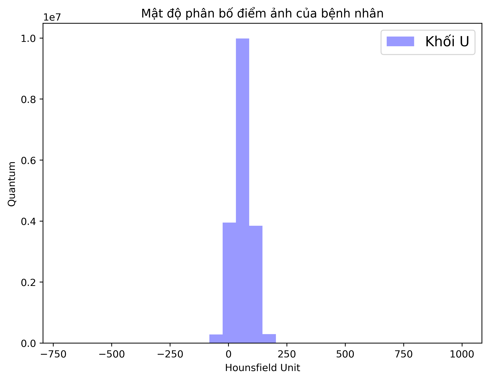
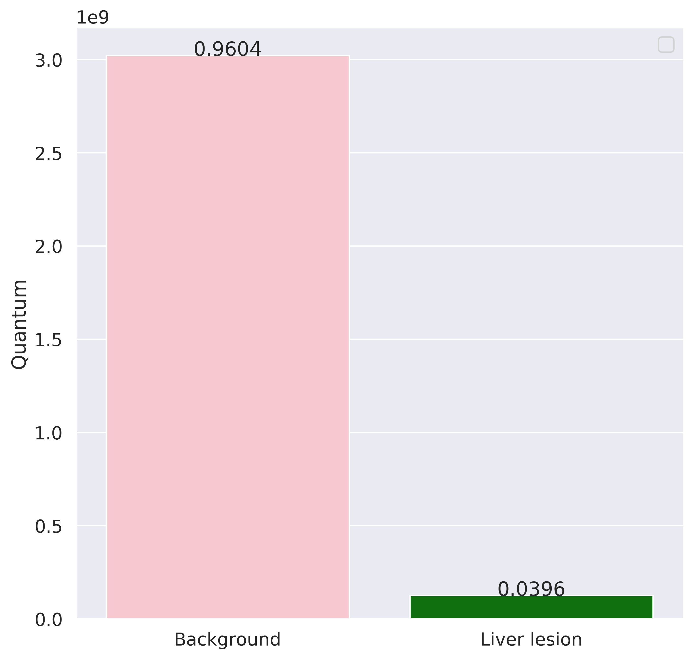

# Detect-liver-tumor-by-CNN3D-and-UNET3D
## 1. About this project :
+ It is my graduate thesis in university (2019).
+ Topic: Detect liver tumors in CT image
+ Dataset: Liver tumor Segmentation Challenge (LiTS) contain 131 contrast-enhanced CT images provided by hospital around the world. If you'd like to download it, you can find in this link: https://competitions.codalab.org/competitions/17094
+ Used models: CNN3D and UNet3D (3D mean using convolution 3D (3x3x3), max pooling 3D (3x3x3),...)

+ Update for readme_brand


## 2. Requirements about enviroment
+ I use python==3.7.0 and tensorfow==1.14.0.
+ About the library, you can install all packages in requirements.txt by run this command:
 ```Shell
pip install -r requirements.txt
```
## 3. Analyse dataset
- Open file: Analyse_data.ipynb
- Function ***Histogram()*** to draw the data's histogram. See below chart:
  
  
- Function ***Information*** to log the tumor information (size of tumor in whole image)
- Function ***PixelRatio*** to draw the ratio chart between tumor and back ground. See below chart:
 


## 3. Training and testing
### 3.1 Training
### 3.2 Testing

## 4. Results

## 5. References
- A list of papers refer to this project:
  * [Detection-aided liver lesion segmentation using deep learning](https://arxiv.org/abs/1711.11069).
  * [Automatic Liver Lesion Segmentation Using A Deep Convolutional Neural Network Method](https://arxiv.org/abs/1704.07239).
  * [V-Net: Fully Convolutional Neural Networks for Volumetric Medical Image Segmentation](https://arxiv.org/abs/1606.04797)
- A list of other great sources that were sources of inspiration:
  * [liverseg-2017-nipsws](https://github.com/imatge-upc/liverseg-2017-nipsws)
  * [MICCAI-LITS2017](https://github.com/assassint2017/MICCAI-LITS2017)
